Project management
=

Welcome to our comprehensive Project Management Application,
designed to streamline the way you manage projects, tasks, resources, and users.
This powerful tool offers a robust set of features aimed at enhancing productivity,
ensuring seamless collaboration, and providing detailed oversight of all project-related activities.

**Key Sections and Functionalities**

**Projects Section:**

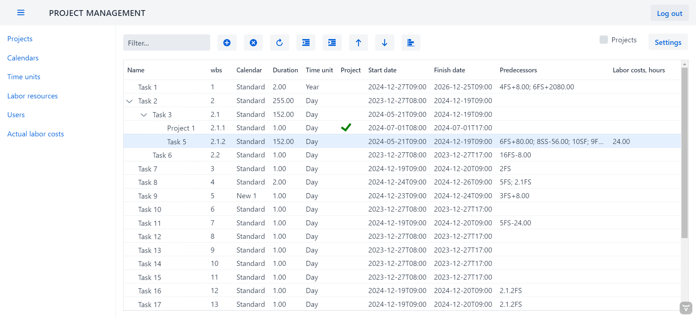

+ **Project and Task Management:**
  + A hierarchical tree view displaying all projects and tasks.
  + Full control for users with "admin" or "project manager" roles to create, edit, delete, and move projects and tasks through intuitive buttons or drag-and-drop functionality.
  + Flexible project nesting and advanced filtering options to manage visibility by name or project-only views.
  + Customizable column display options in the settings menu (note: user settings saving is currently unavailable).

+ **Task Editing:**
  + A dedicated form with four detailed tabs:
    + **Main:** Comprehensive task attribute management.
    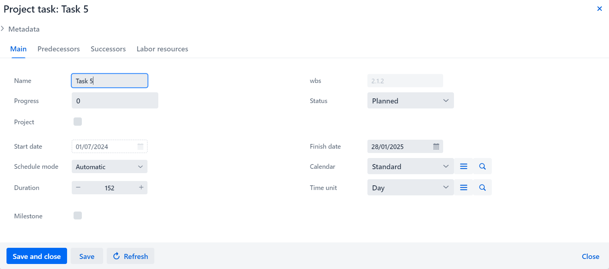
    
    + **Predecessors:** Manage task dependencies with options to add, edit, and delete predecessors.
    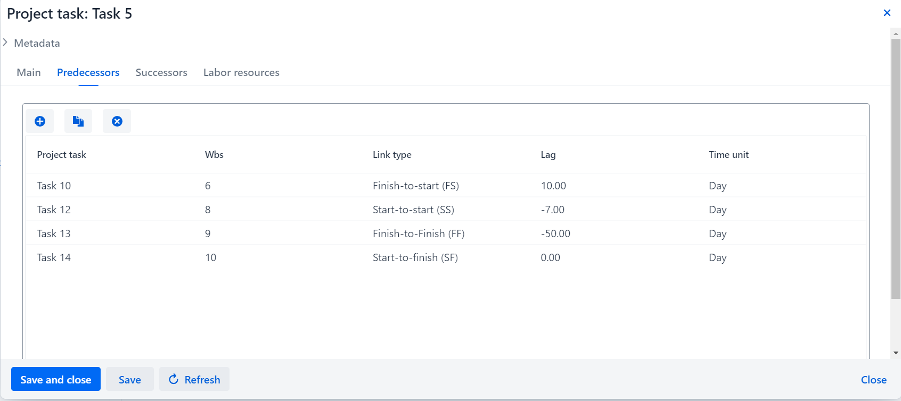
    
    + **Successors:** View but not edit task successors.
    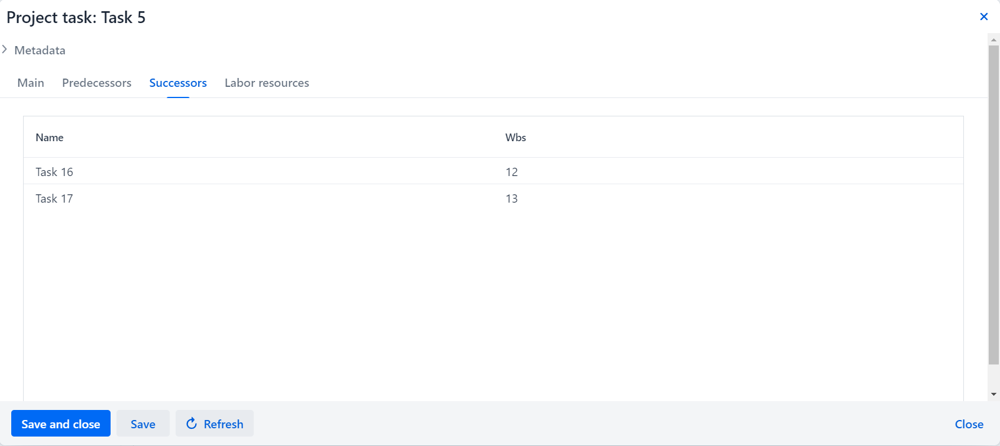
    
    + **Labor Resources:** Plan and allocate labor resources effectively.
    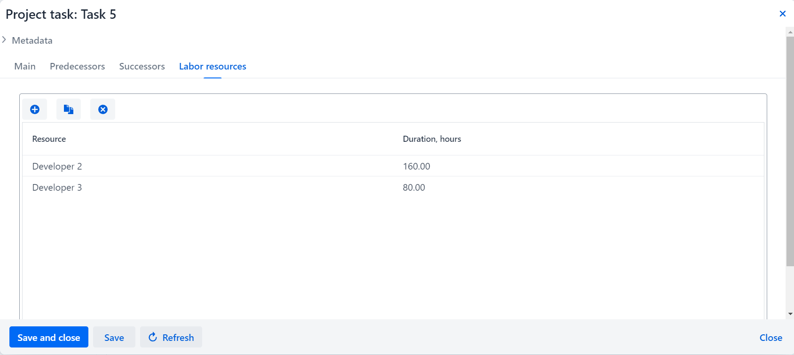

**Calendars Section:**

+ **Calendar Management:**

  + Add, edit, and delete calendars, with all changes triggering recalculations of task deadlines.
  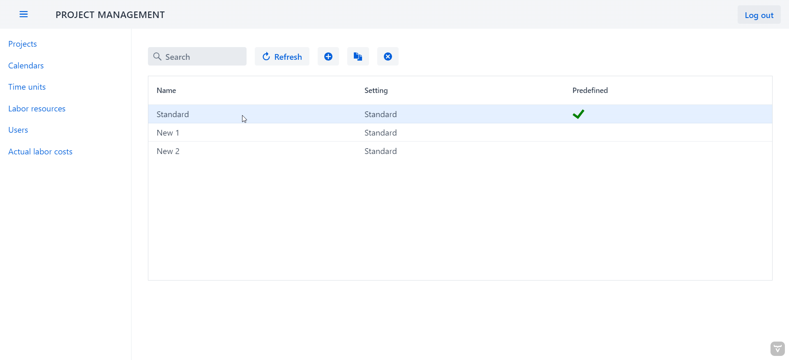
  
  + A familiar interface akin to MS Project 2013 for setting exceptions and working weeks.
  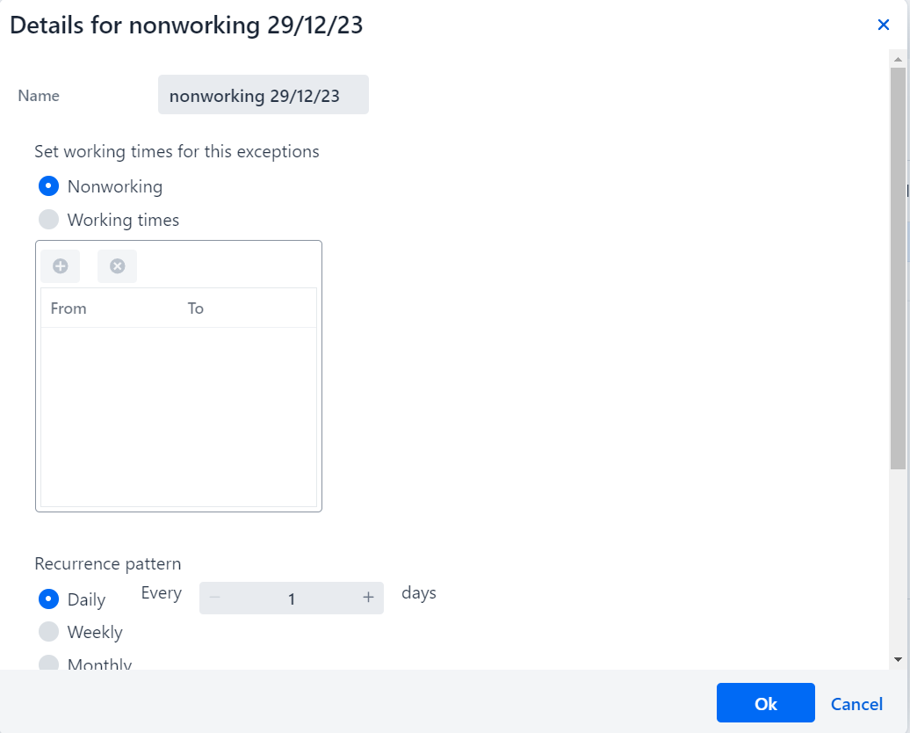
  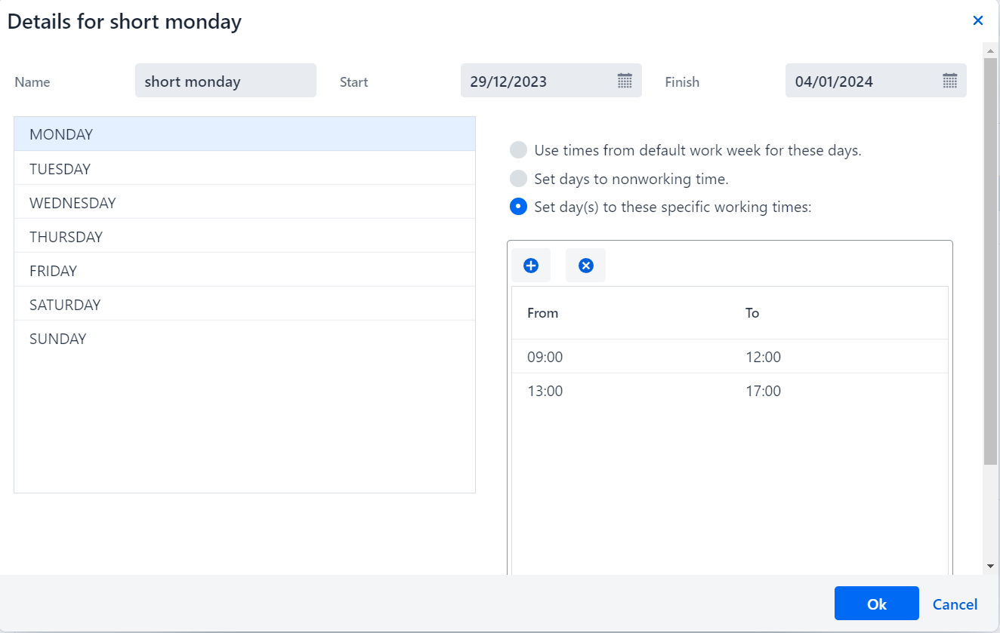
  
  + A visual calendar view to inspect changes day-by-day, selectable by month or year.
  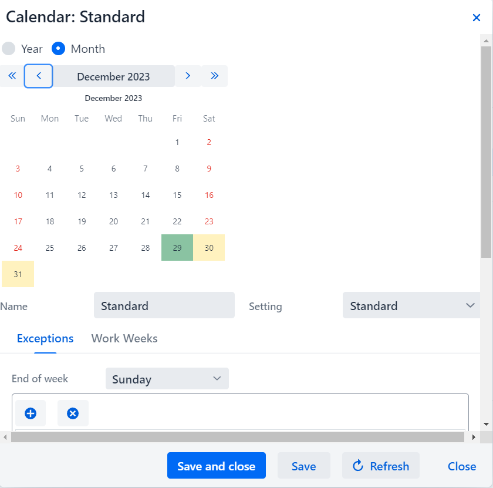

**Time Units Section:**

+ **Time Unit Management:**
  + Add, edit, and delete time units that determine the task duration calculations.
  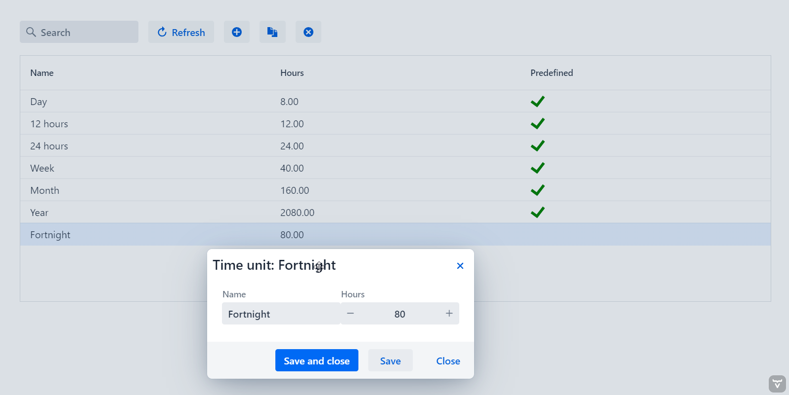  

**Labor Resources Section:**

+ **Resource Management:**
  + Manage labor resources with capabilities to add, edit, and delete.

**Users Section:**

+ **User Management:**
  + Available exclusively to administrators to manage user accounts, roles, and permissions.
  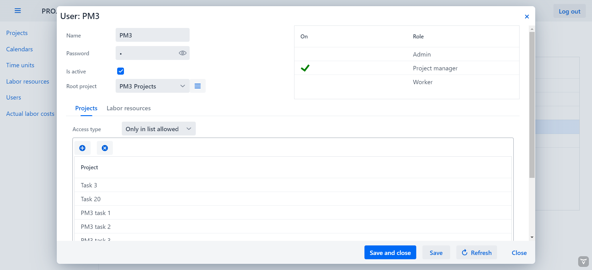
  
  + Role-based security to govern data visibility and access.
  + Four types of access control for project managers, ranging from restrictive to comprehensive task visibility.

**The default user who creates at the very beginning has the following credentials:\
Login: Admin\
Password: 1**

**Actual Labor Costs Section:**

+ **Tracking Labor Costs:**
  + Record, edit, and delete actual labor costs.
  + Assign tasks and track work periods by dragging tasks into a designated table, reflecting actual labor costs against planned resources.
  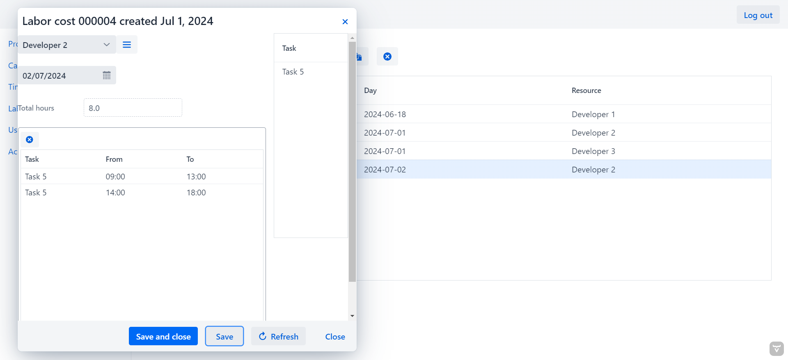

