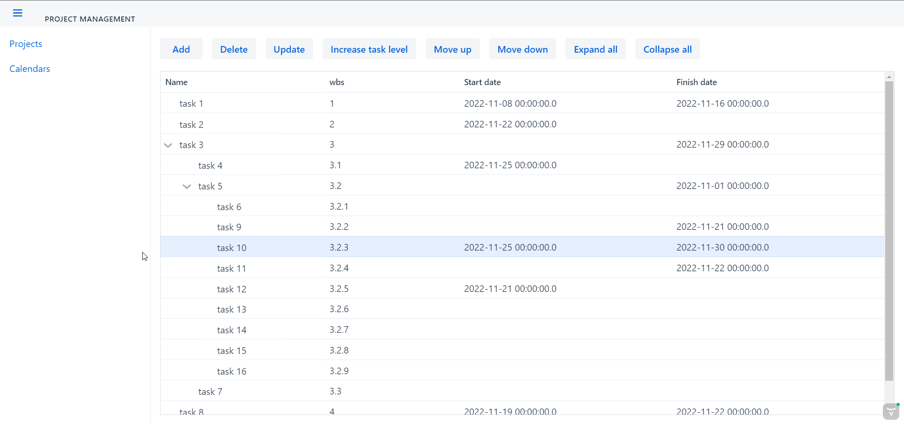
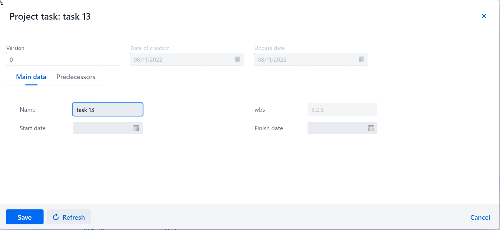
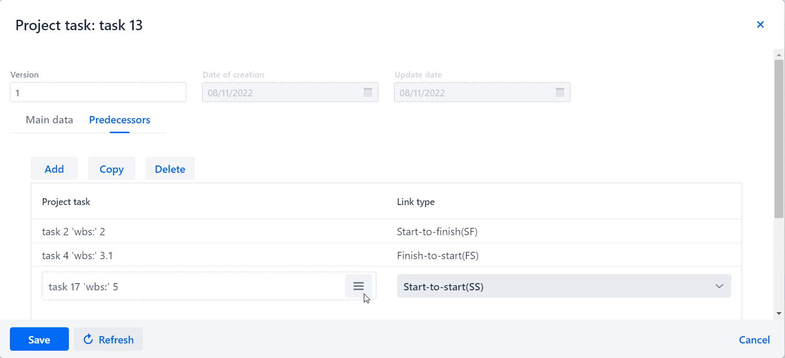

Project management
=

Это Spring+Vaadin проект, предназначенный для управления проектами.

В проекте используется Spring Security, поэтому для аутентификации пользователя используются следующие данные: phone number: 000, password: ADMIN 

Пользователю доступно три раздела:

Раздел Projects:

Здесь доступны следующие действия с проектными задачами:
+ Создание.
+ Удаление.
+ Перемещение. В пределах дерева можно перемещать задачи с помощью кнопок и перетаскивать мышью
+ Двойным кликом открывается форма редактирования задачи (Данные задачи можно менять только с помощью формы редактирования)

+ + На вкладке "Main" распологаются основные данные задачи

+ + На вкладке "Predecessors" можно задавать предшественников задачи.
Для добавления предшественников нужно нажать на кнопку Add, после чего добавиться строка в таблицу,
далее нажать на кнопку .
В открывшейся форме выбора выбрать нужную задачи, либо нажать на кнопку Select, либо двойным кликом мышки.

В разделе Calendars можно добавлять календари проектных задач, но пока они не используются.

В разделе Users можно создавать новых пользователей и редактировать текущих.
